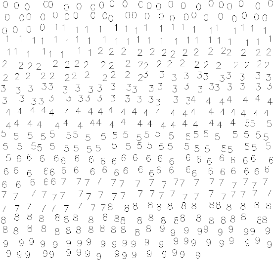

<div align="center">
EmbedroW

<div id="top"></div>
<!--
*** Thanks for checking out. If you have a suggestion
*** that would make this better, please fork the repo and create a pull request
*** or simply open an issue with the tag "enhancement".
*** Don't forget to give the project a star!
*** Thanks again! Now go create something AMAZING! :D
-->


<!-- PROJECT SHIELDS -->
<!--
*** I'm using markdown "reference style" links for readability.
*** Reference links are enclosed in brackets [ ] instead of parentheses ( ).
*** See the bottom of this document for the declaration of the reference variables
*** for contributors-url, forks-url, etc. This is an optional, concise syntax you may use.
*** https://www.markdownguide.org/basic-syntax/#reference-style-links
-->

  
[![Contributors][contributors-shield]][contributors-url]
[![Forks][forks-shield]][forks-url]
[![Stargazers][stars-shield]][stars-url]
[![Issues][issues-shield]][issues-url]
[![MIT License][license-shield]][license-url]
[![LinkedIn][linkedin-shield]][linkedin-url]
  
 </div>


<!-- PROJECT LOGO -->
<br />
<div align="center">
  <a href="https://github.com/DrCybernotix/EmbedroW/blob/main/myLogos/EmbedroW_Logo1.png">
    
  </a>

  <h3 align="center">A t-SNE projector for higher dimensional data and Word Embeddings</h3>

  <p align="center">
   This project is a tool to setup and utilize the standalone version of Tensorflow Embedding Projector.
    <br />
    <a href="https://github.com/DrCybernotix/EmbedroW/blob/main/README.md"><strong>Explore the docs »</strong></a>
    <br />
    <br />
    <a href="https://github.com/DrCybernotix/EmbedroW/blob/main/README.md">View Demo</a>
    ·
    <a href="https://github.com/DrCybernotix/EmbedroW/issues">Report Bug</a>
    ·
    <a href="https://github.com/DrCybernotix/EmbedroW/pulls">Request Feature</a>
  </p>
</div>

####   ~ t-Distributed Stochastic Neighbor Embedding (t-SNE) is a dimensionality reduction technique that is particularly well suited for the visualisation of large datasets. The technique is implementable using Barnes-Hut approximations, allowing it to be used on large real-world datasets. We used it on data sets containing up to 30 million examples.
[Read More](https://towardsdatascience.com/an-introduction-to-t-sne-with-python-example-5a3a293108d1)

####    ~ It is a build-in tool of Google's Machine Learning framework, [TensorFlow](https://tensorflow.org) . This project is all about an implementation of **tool** to use the standalone prototype you can find [here](https://github.com/tensorflow/embedding-projector-standalone)

<!-- TABLE OF CONTENTS -->
<details>
  <summary>Table of Contents</summary>
  <ol>
    <li>
      <a href="#about-the-project">About The Project</a>
      <ul>
        <li><a href="#built-with">Built With</a></li>
      </ul>
    </li>
    <li>
      <a href="#getting-started">Getting Started</a>
      <ul>
        <li><a href="#prerequisites">Prerequisites</a></li>
        <li><a href="#installation">Installation</a></li>
      </ul>
    </li>
    <li><a href="#usage">Usage</a></li>
    <li><a href="#roadmap">Roadmap</a></li>
    <li><a href="#contributing">Contributing</a></li>
    <li><a href="#license">License</a></li>
    <li><a href="#contact">Contact</a></li>
    <li><a href="#acknowledgments">Acknowledgments</a></li>
  </ol>
</details>


<!-- ABOUT THE PROJECT -->
## About The Project

<p align="center">
  Whilst learning tensorflow I stumbled upon the concept of embedding, which I found quite interesting in it's course taking the motivation through it, here I tried to create an efficient tool that will help you visualize your embeddings more efficientky using the TF embedding tool.Certainly for us, there seems to be an excellent tool that is part of Tensorboard. This is meant to be used as Tensorboard , but in my opinion, tensorboard is too cumbersome, and unless you are already using Tensorflow, it is too much of a fuss to use. As a direct consequence, we can only use the self - contained version. The creators did not appear to have written any documentation for the standalone version, but it is pretty straightforward, and Then I will walk you through the pathways in this editorial. To export data from the model, we wrote a few wrappers. 
  The specifics of the task will be included at the end of the story.
</p>
Follow through to get started!

<p align="right">(<a href="#top">back to top</a>)</p>

Example Output/Standalone : 
<p align="center">
  
</p>

### Built With

This section is the list of any major frameworks/libraries used to bootstrap the subsequent project. Leave any add-ons/plugins for the acknowledgements section. Here are a few assets to work with : 

* [Tensorflow](https://www.tensorflow.org/)
* [Scikitlearn](https://scikit-learn.org/stable/)
* [Keras](https://keras.io/)
* [Python3](https://www.python.org/download/releases/3.0/)
* [numpy](https://numpy.org/)
* [Anaconda.(For virtual environment)](https://www.anaconda.com/)
* [HTML](https://en.wikipedia.org/wiki/HTML)

<p align="right">(<a href="#top">back to top</a>)</p>


<!-- GETTING STARTED -->
## Getting Started
Following are the instructions on setting up your project locally.
To get a local copy up and running, follow these simple steps.

### Prerequisites

This is an example of how to list things you need to use the software and how to install them.
* pip 
  ```sh
  python -m pip install --upgrade pip
  ```
* npm
  ```sh
  npm install npm@latest -g
  ```
* opencv-python
```sh
pip install opencv-python
```

### Installation

Install TensorFlow with pip
   TensorFlow 2 packages are available
     * tensorflow —Latest stable release with CPU and GPU support (Ubuntu and Windows)
     * tf-nightly —Preview build (unstable). Ubuntu and Windows include GPU support.
Older versions of TensorFlow
For TensorFlow 1.x, CPU and GPU packages are separate:

  * tensorflow==1.15 —Release for CPU-only
  * tensorflow-gpu==1.15 —Release with GPU support (Ubuntu and Windows)
System requirements
  * Python 3.7–3.9
  * Python 3.9 support requires TensorFlow 2.5 or later.
  * Python 3.8 support requires TensorFlow 2.2 or later.


1. Clone the repo
   ```sh
   git clone https://github.com/DrCybernotix/EmbedroW.git
  
   ```
   
   After cloning just open the project folder in any IDE, (Recommend: Pycharm or Visual Studio)
   Run the test.py first or either you can do this from the terminal.
   ```shell
   python launch.py
   ```
   
   For terminal :
   ```sh
   cd (paste the directory location where you inported the repository)
   python launch.py
   ```
2. Install packages
   ```sh
   npm install
   ```
   
   Now you might have got the output pop-up in your browser, if not copy paste this Port ID in your browser at :  http://localhost:8000,
   or wahtever the IDE you have run into has output you.(If you have run this project through your defined IDE). Eihter run this command for redirected output through the shell    ```
   python -m SimpleHTTPServer
   ```

<p align="right">(<a href="#top">back to top</a>)</p>


<!-- USAGE EXAMPLES -->
## Usage

Useful examples of how the model actually works and what does it do when provided costum inputs

_For more examples, please refer to the (coming soon!) [Documentation](https://example.com)_

<p align="right">(<a href="#top">back to top</a>)</p>


#### With sprite:


#### With label


### How to visualize your custom data : 
The Projector accepts as input a NxD tensor, where N is the number of samples (or embeddings) and D is the dimension of each sample. The tensor is kept in a file (raw float bytes for tsv). A sample is represented as a point on the plot. We can add metadata to a sample, a picture (called asprite, or labels / class id or names ).

A example sprite image:



We designed a method that would handle everything for you; simply call it with your data. BOOM! Tensor is represented as binary bytes.

```
write_image_embeddings(root, title, feats, labels, imgs, sprite_size)
'''
:param root: root dir of `Embedding Project` tool
:param title: name of the tensor
:param feats: embedding tensor NxDim
:param labels: labels for each sample NxNumClasses
:param [optional] imgs: images in format NHWC
:param [optional] sprite_size: image sprite size
:param mode: 'w' -- write, 'w+' -- update or append, '+' -- append
'''
```

Now how do you import your tensors in .tsv format? 

```python
write_tsv_embeddings(prefix, feats, labels=None):
```
🔑Note:
.tsv files can be loaded in the web browser in real time, on-line.


This tool features an intuitive way of visualizing any vector array in tensor format using a small dependency stack. It is intended to be independent of any library. Furthermore, it employs a static file system, allowing you to broadcast your findings without the need for a private server.

<!-- ROADMAP -->
## Roadmap

- [x] Add Changelog
- [x] Add back to top links
- [ ] Add Additional Templates w/ Examples
- [ ] Add "components" document to easily copy & paste sections of the readme


See the [open issues](https://github.com/DrCybernotix/BlackLabelizer/issues) for a full list of proposed features (and known issues).


<p align="right">(<a href="#top">back to top</a>)</p>


<!-- CONTRIBUTING -->
## Contributing

Contributions are what make the open source community such an amazing place to learn, inspire, and create! Any contributions you make are **greatly appreciated**.

If you have a suggestion that would make this better, please fork the repo and create a pull request. You can also simply open an issue with the tag "enhancement".
Don't forget to give the project a star! Thanks again!

1. Fork the Project
2. Create your Feature Branch (`git checkout -b feature/AmazingFeature`)
3. Commit your Changes (`git commit -m 'Add some AmazingFeature'`)
4. Push to the Branch (`git push origin feature/AmazingFeature`)
5. Open a Pull Request

<p align="right">(<a href="#top">back to top</a>)</p>


<!-- LICENSE -->
## License

Distributed under the MIT License. See `LICENSE.txt` for more information.

<p align="right">(<a href="#top">back to top</a>)</p>


<!-- CONTACT -->
## Contact

Twitter/Email - [@DrCybernotix](https://twitter.com/DrCybernotix)

12shreyashh@gmail.com

Project Link: [EmbedroW](https://github.com/DrCybernotix/EmbedroW)

<p align="right">(<a href="#top">back to top</a>)</p>


<!-- ACKNOWLEDGMENTS -->
## Acknowledgments

The list of resources I found helpful whilst makingg this project and would like to give credit to :

* [Choose an Open Source License](https://choosealicense.com)
* [Choosing the Estimator](https://scikit-learn.org/stable/tutorial/machine_learning_map/index.html)
* [Malven's Grid Cheatsheet](https://grid.malven.co/)
* [Img Shields](https://shields.io)
* [GitHub Pages](https://pages.github.com)
* [React Icons](https://react-icons.github.io/react-icons/search)

<p align="right">(<a href="#top">back to top</a>)</p>


<!-- MARKDOWN LINKS & IMAGES -->
<!-- https://www.markdownguide.org/basic-syntax/#reference-style-links -->
[contributors-shield]: https://img.shields.io/github/contributors/DrCybernotix/EmbedroW.svg?style=for-the-badge
[contributors-url]: https://github.com/DrCybernotix/EmbedroW/graphs/contributors
[forks-shield]: https://img.shields.io/github/forks/DrCybernotix/EmbedroW.svg?style=for-the-badge
[forks-url]: https://github.com/DrCybernotix/EmbedroW/network/members
[stars-shield]: https://img.shields.io/github/stars/DrCybernotix/EmbedroW.svg?style=for-the-badge
[stars-url]: https://github.com/DrCybernotix/EmbedroW/stargazers
[issues-shield]: https://img.shields.io/github/issues/DrCybernotix/EmbedroW?style=for-the-badge
[issues-url]: https://github.com/DrCybernotix/EmbedroW/issues
[license-shield]: https://img.shields.io/github/license/DrCybernotix/EmbedroW.svg?style=for-the-badge
[license-url]: https://github.com/DrCybernotix/EmbedroW/blob/master/LICENSE.txt
[linkedin-shield]: https://img.shields.io/badge/-LinkedIn-black.svg?style=for-the-badge&logo=linkedin&colorB=555
[linkedin-url]: https://in.linkedin.com/in/shreyash-bhatkar-5bb904194
[product-screenshot]: images/screenshot.png
